# KavachAI — Architecture & Data-Flow Analysis

> **Scope**: This document is derived exclusively from the implemented source code in the repository. Every diagram cites the specific files, classes, and line ranges that support it. Items marked **[INFERRED]** are reasonable deductions not directly visible in code.

---

## 1. System Overview Diagram

Shows all major modules, their relationships, external services, and data stores as implemented.

```mermaid
graph TB
    subgraph "Browser Client"
        FE["Next.js 16 Frontend<br/>(React 19 + Tailwind 4)"]
    end

    subgraph "FastAPI Backend (Python)"
        MAIN["FastAPI App<br/>app/main.py"]
        
        subgraph "API Routers"
            R_SESSION["Session Router<br/>/api/v1/session"]
            R_KB["Knowledge Base Router<br/>/api/v1/knowledge-base/*"]
            R_INV["Investigations Router<br/>/api/v1/investigations/*"]
            R_EV["Evidence Router<br/>/api/v1/evidence/*"]
            R_EXP["Export Router<br/>/api/v1/exports/*"]
            R_AUD["Audit Router<br/>/api/v1/audit-log"]
            R_APP["Approvals Router<br/>/api/v1/approvals/*"]
            R_CHAT["Chat Router<br/>/api/v1/conversations/*"]
        end

        subgraph "Orchestration Engines"
            ORCH["InvestigationRunner<br/>orchestrator/investigation.py"]
            LG_INV["LangGraph Investigation Graph<br/>langgraph/graphs/investigation_graph.py"]
            LG_APP["LangGraph Approval Graph (HITL)<br/>langgraph/graphs/approval_graph.py"]
            LG_CHAT["LangGraph ReAct Chat Agent<br/>langgraph/graphs/chat_graph.py"]
            MR["ModelRouter<br/>orchestrator/model_router.py"]
        end

        subgraph "AI Agents & Specialist Nodes"
            PLAN["Planner Agent / plan_node"]
            DOC["Document Agent"]
            DATA["Data Agent"]
            VIS["Vision Agent"]
            RAG["RAG Agent"]
            SYN["Synthesis Agent / synthesis_node"]
            VER["Verification Agent / verification_node"]
        end

        subgraph "Tiered Ingestion Pipeline"
            EXT["extract.py<br/>(4-Tier OCR: fitz → density → pytesseract → VLM)"]
            CHK["chunk.py"]
            TAG["tag.py"]
            EMB["embed.py"]
            TAB["tabular.py"]
        end

        subgraph "Services & Security"
            AUD_SVC["Audit Service (WORM)"]
            RPT_SVC["Report Service (Briefings)"]
            SBOX["Docker Code Sandbox<br/>services/code_sandbox.py<br/>(Isolated, --network none, AST)"]
        end
    end

    subgraph "Data Stores & Persistence"
        SQLITE[("SQLite<br/>kavachai.db")]
        CHROMA[("ChromaDB<br/>kavachai_chunks<br/>(887 chunks: Demo + MRPL Statutory)")]
        OBJ[("Object Store<br/>Filesystem")]
        GRAPH["NetworkX<br/>Graph Store<br/>(In-Memory Topology)"]
        LG_CHECK[("LangGraph Checkpointer<br/>SqliteSaver (State Persistence)")]
    end

    OLLAMA["Ollama Server<br/>(localhost:11434)<br/>Qwen 2.5 3B + Qwen 2.5-VL 3B + nomic-embed-text"]

    FE -->|"HTTP/SSE"| MAIN
    MAIN --> R_SESSION & R_KB & R_INV & R_EV & R_EXP & R_AUD & R_APP & R_CHAT
    R_INV --> ORCH & LG_INV
    R_APP --> LG_APP
    R_CHAT --> LG_CHAT
    ORCH & LG_INV --> PLAN & DOC & DATA & VIS & RAG & SYN & VER
    DATA --> SBOX
    LG_INV & LG_APP & LG_CHAT --> LG_CHECK
    PLAN & SYN & VER -->|"generate/chat"| MR
    DOC & RAG -->|"embed"| MR
    EXT -->|"VLM OCR fallback"| MR
    EMB -->|"embed"| MR
    MR -->|"HTTP POST"| OLLAMA
    R_KB --> EXT --> CHK --> TAG --> EMB
    EMB --> CHROMA
    R_KB --> TAB --> SQLITE
    R_SESSION & R_INV & R_AUD & R_APP --> SQLITE
    DOC & RAG --> CHROMA
    DATA --> SQLITE
    VIS --> GRAPH
    R_KB & R_EV --> OBJ
    AUD_SVC --> SQLITE
    RPT_SVC --> R_INV & LG_APP
```

**Source references:**
- Entry point & lifespan: [main.py](file:///c:/Users/HP/Desktop/SIH/KavachAI/backend/app/main.py#L21-L85)
- Config & env: [config.py](file:///c:/Users/HP/Desktop/SIH/KavachAI/backend/app/config.py#L12-L48)
- LangGraph graphs: [graphs/](file:///c:/Users/HP/Desktop/SIH/KavachAI/backend/app/langgraph/graphs/)
- Code sandbox: [code_sandbox.py](file:///c:/Users/HP/Desktop/SIH/KavachAI/backend/app/services/code_sandbox.py)
- Frontend entry: [page.tsx](file:///c:/Users/HP/Desktop/SIH/KavachAI/frontend/app/page.tsx) (session login), [workspace/page.tsx](file:///c:/Users/HP/Desktop/SIH/KavachAI/frontend/app/workspace/page.tsx) (query input)
- API client: [api.ts](file:///c:/Users/HP/Desktop/SIH/KavachAI/frontend/app/services/api.ts)

---

## 2. Detailed Workflow Diagrams

### 2.1 Workflow A — Session Creation (User Onboarding)

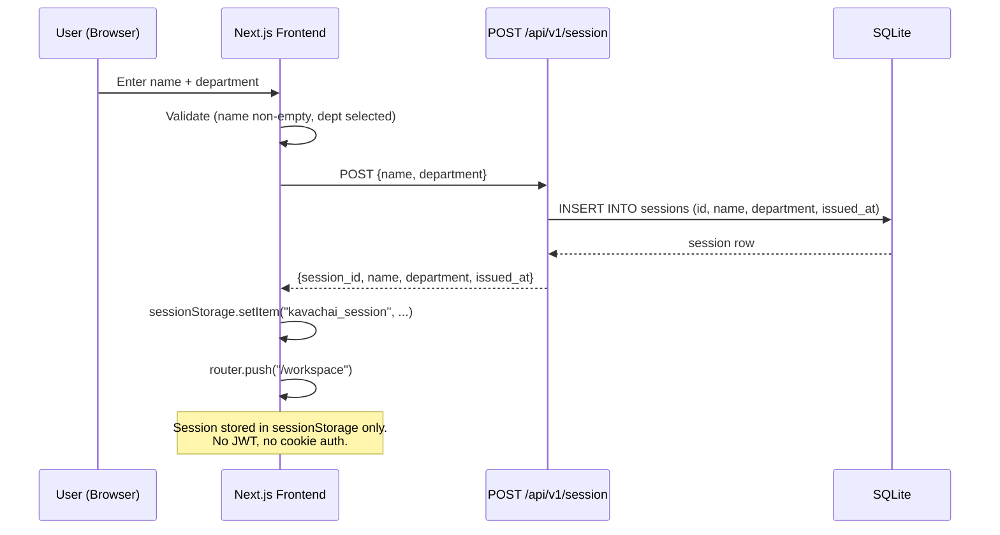

**Source references:**
- Frontend form: [page.tsx L33-L51](file:///c:/Users/HP/Desktop/SIH/KavachAI/frontend/app/page.tsx#L33-L51)
- Session hook: [useSession.ts L34-L42](file:///c:/Users/HP/Desktop/SIH/KavachAI/frontend/app/hooks/useSession.ts#L34-L42)
- Backend router: [session.py L17-L33](file:///c:/Users/HP/Desktop/SIH/KavachAI/backend/app/routers/session.py#L17-L33)
- SQL model: [sql_models.py L31-L42](file:///c:/Users/HP/Desktop/SIH/KavachAI/backend/app/db/sql_models.py#L31-L42)

---

### 2.2 Workflow B — Document Ingestion Pipeline (with 4-Tier OCR)

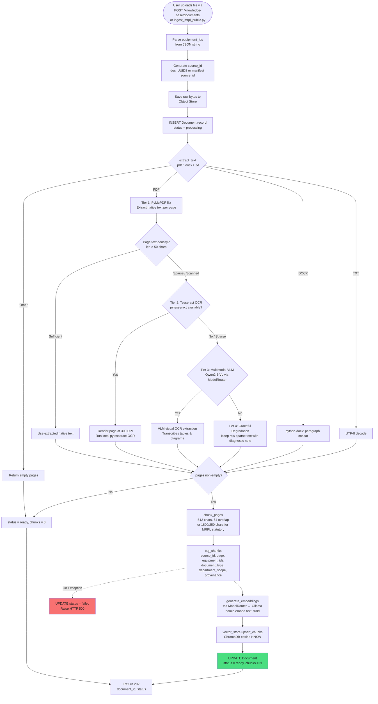

**Source references:**
- Router: [knowledge_base.py L36-L122](file:///c:/Users/HP/Desktop/SIH/KavachAI/backend/app/routers/knowledge_base.py#L36-L122)
- MRPL Ingestion Script: [ingest_mrpl_public.py](file:///c:/Users/HP/Desktop/SIH/KavachAI/backend/scripts/ingest_mrpl_public.py)
- Tiered OCR Extract: [extract.py](file:///c:/Users/HP/Desktop/SIH/KavachAI/backend/app/ingestion/extract.py)
- Chunk: [chunk.py L13-L54](file:///c:/Users/HP/Desktop/SIH/KavachAI/backend/app/ingestion/chunk.py#L13-L54)
- Tag: [tag.py L17-L64](file:///c:/Users/HP/Desktop/SIH/KavachAI/backend/app/ingestion/tag.py#L17-L64)
- Embed: [embed.py L14-L35](file:///c:/Users/HP/Desktop/SIH/KavachAI/backend/app/ingestion/embed.py#L14-L35)

---

### 2.3 Workflow C — Dataset Ingestion

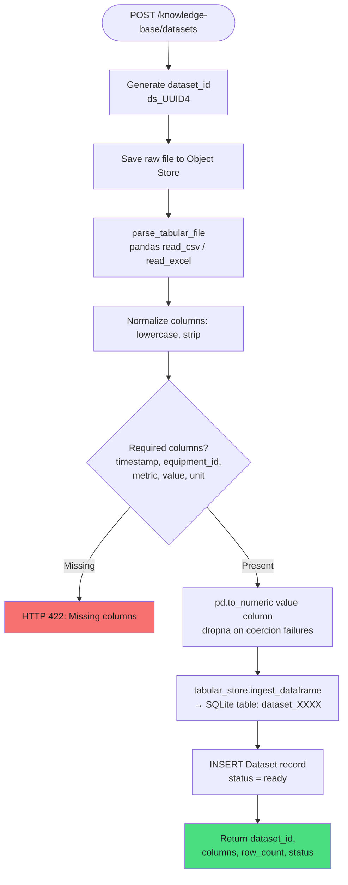

**Source references:**
- Router: [knowledge_base.py L148-L188](file:///c:/Users/HP/Desktop/SIH/KavachAI/backend/app/routers/knowledge_base.py#L148-L188)
- Tabular parse: [tabular.py L18-L78](file:///c:/Users/HP/Desktop/SIH/KavachAI/backend/app/ingestion/tabular.py#L18-L78)
- Tabular store: [tabular_store.py L34-L66](file:///c:/Users/HP/Desktop/SIH/KavachAI/backend/app/db/tabular_store.py#L34-L66)

---

### 2.4 Workflow D — Investigation Pipeline (Core Business Flow)

This is the most complex flow in the system. Split into 3 sub-diagrams.

#### 2.4.1 Investigation Creation & Background Dispatch

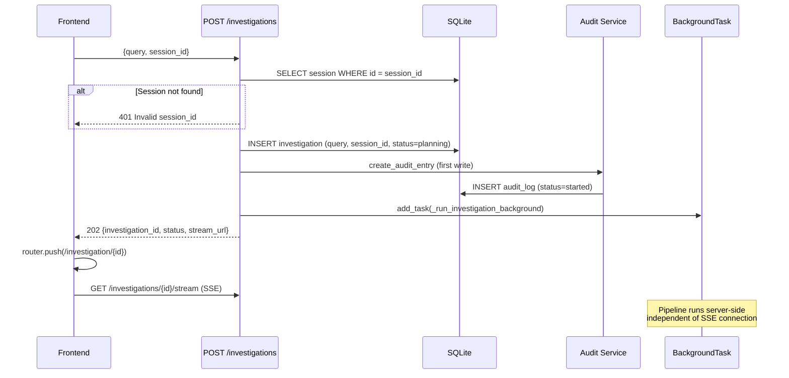

**Source references:**
- Create endpoint: [investigations.py L78-L122](file:///c:/Users/HP/Desktop/SIH/KavachAI/backend/app/routers/investigations.py#L78-L122)
- Background runner: [investigations.py L34-L75](file:///c:/Users/HP/Desktop/SIH/KavachAI/backend/app/routers/investigations.py#L34-L75)
- Audit first write: [audit_service.py L18-L39](file:///c:/Users/HP/Desktop/SIH/KavachAI/backend/app/services/audit_service.py#L18-L39)

#### 2.4.2 Agent Pipeline Execution (InvestigationRunner.run)

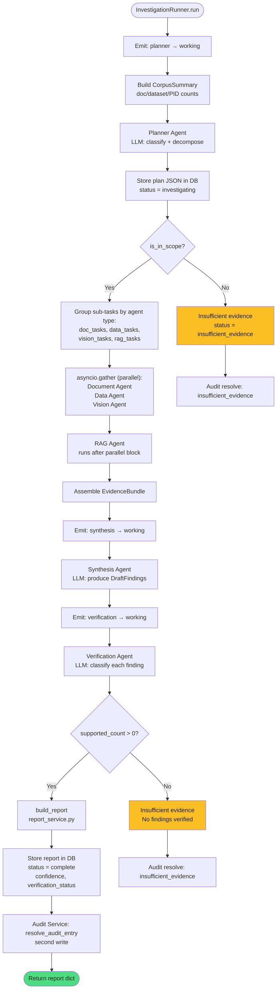

**Source references:**
- Full pipeline: [investigation.py L64-L185](file:///c:/Users/HP/Desktop/SIH/KavachAI/backend/app/orchestrator/investigation.py#L64-L185)
- Planner: [planner.py L46-L108](file:///c:/Users/HP/Desktop/SIH/KavachAI/backend/app/agents/planner.py#L46-L108)
- Synthesis: [synthesis.py L46-L106](file:///c:/Users/HP/Desktop/SIH/KavachAI/backend/app/agents/synthesis.py#L46-L106)
- Verification: [verification.py L53-L127](file:///c:/Users/HP/Desktop/SIH/KavachAI/backend/app/agents/verification.py#L53-L127)
- Report builder: [report_service.py L17-L72](file:///c:/Users/HP/Desktop/SIH/KavachAI/backend/app/services/report_service.py#L17-L72)

#### 2.4.3 Individual Agent Detail

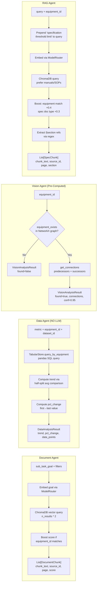

**Source references:**
- Document Agent: [document_agent.py L21-L78](file:///c:/Users/HP/Desktop/SIH/KavachAI/backend/app/agents/document_agent.py#L21-L78)
- Data Agent: [data_agent.py L21-L87](file:///c:/Users/HP/Desktop/SIH/KavachAI/backend/app/agents/data_agent.py#L21-L87) — **pure pandas, zero LLM calls**
- Vision Agent: [vision_agent.py L19-L55](file:///c:/Users/HP/Desktop/SIH/KavachAI/backend/app/agents/vision_agent.py#L19-L55) — **pre-computed NetworkX, no VLM**
- RAG Agent: [rag_agent.py L21-L83](file:///c:/Users/HP/Desktop/SIH/KavachAI/backend/app/agents/rag_agent.py#L21-L83)

---

### 2.5 Workflow E — SSE Streaming to Frontend

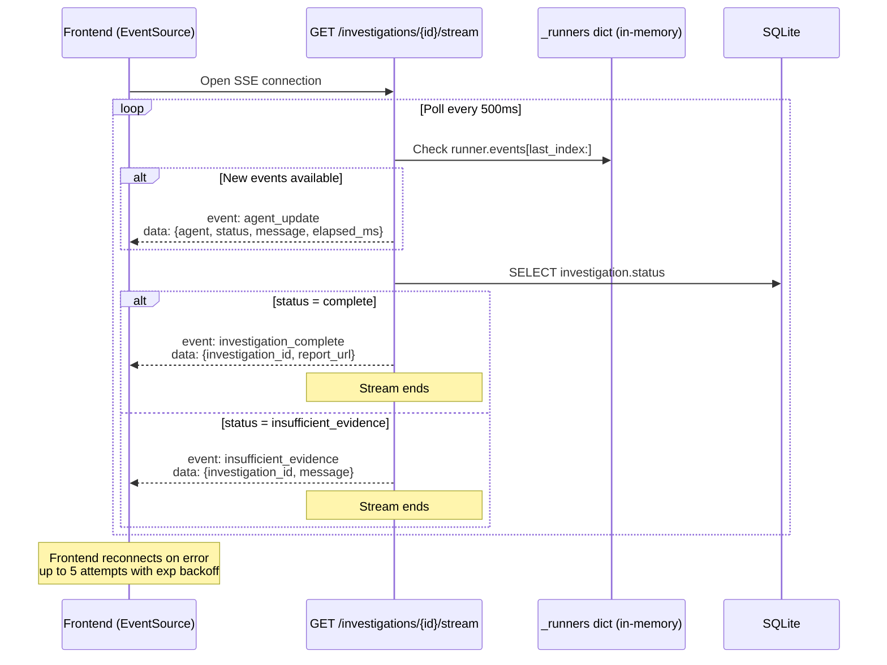

**Source references:**
- SSE endpoint: [investigations.py L125-L179](file:///c:/Users/HP/Desktop/SIH/KavachAI/backend/app/routers/investigations.py#L125-L179)
- SSE client: [sse.ts L16-L117](file:///c:/Users/HP/Desktop/SIH/KavachAI/frontend/app/services/sse.ts#L16-L117)
- Dedup: [sse.ts L21](file:///c:/Users/HP/Desktop/SIH/KavachAI/frontend/app/services/sse.ts#L21) — `seenEventIds` Set

---

### 2.6 Workflow F — Report Export (PDF)

```mermaid
flowchart TD
    START([POST /investigations/{id}/export]) --> FETCH[Fetch Investigation from DB]
    FETCH --> HAS_REPORT{report exists?}
    HAS_REPORT -->|No| ERR_404[HTTP 404]
    HAS_REPORT -->|Yes| CHECK_FMT{format == pdf?}
    CHECK_FMT -->|No| ERR_422[HTTP 422: Unsupported format]
    CHECK_FMT -->|Yes| GEN_ID[Generate export_id: exp_UUID4]
    GEN_ID --> BUILD_PDF[_generate_pdf via ReportLab<br/>Custom KavachAI palette<br/>Gold/teal — no blue hyperlinks]
    BUILD_PDF --> SAVE[Save to ./data/exports/]
    SAVE --> RETURN[Return export_id + download_url]
    
    DOWNLOAD([GET /exports/{filename}]) --> SERVE[FileResponse<br/>application/pdf]

    style ERR_404 fill:#f87171,color:#1e1e1e
    style ERR_422 fill:#f87171,color:#1e1e1e
```

**Source references:**
- Export router: [export.py L25-L72](file:///c:/Users/HP/Desktop/SIH/KavachAI/backend/app/routers/export.py#L25-L72)
- PDF generator: [export.py L75-L140](file:///c:/Users/HP/Desktop/SIH/KavachAI/backend/app/routers/export.py#L75-L140)

---

### 2.7 Workflow G — Audit Log (Append-Only)

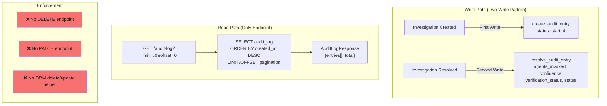

**Source references:**
- Audit service: [audit_service.py](file:///c:/Users/HP/Desktop/SIH/KavachAI/backend/app/services/audit_service.py)
- Audit router: [audit.py](file:///c:/Users/HP/Desktop/SIH/KavachAI/backend/app/routers/audit.py) — GET only
- SQL model comment: [sql_models.py L107-L114](file:///c:/Users/HP/Desktop/SIH/KavachAI/backend/app/db/sql_models.py#L107-L114)

---

### 2.8 Workflow H — Error/Degradation Handling & Offline Fallback

```mermaid
flowchart TD
    subgraph "Model Router Resilience"
        CHECK[is_ollama_available?<br/>GET /api/tags, 300ms timeout,<br/>5s cache]
        CHECK -->|Online| LIVE[Call Ollama API<br/>/api/generate or /api/chat]
        CHECK -->|Offline| OFFLINE[_offline_generate<br/>Deterministic hardcoded responses<br/>for 3 demo scenarios]
        LIVE -->|HTTP error| OFFLINE
    end

    subgraph "Embedding Fallback"
        EMB_CHECK[Ollama available?]
        EMB_CHECK -->|Yes| EMB_LIVE[/api/embed → 768d vectors]
        EMB_CHECK -->|No| EMB_PSEUDO[_pseudo_embed<br/>MD5 hash-bag → 768d<br/>preserves cosine similarity]
    end

    subgraph "Agent-Level Degradation"
        DOC_FAIL[Document Agent fails] --> DOC_SKIP[Emit: failed<br/>Continue pipeline]
        DATA_NONE[No dataset available] --> DATA_SKIP[Emit: skipped<br/>Drop data sub-finding]
        VIS_TIMEOUT[Vision Agent timeout] --> VIS_SKIP[Emit: failed<br/>Continue without P&ID]
        SYNTH_BAD[Synthesis bad JSON] --> SYNTH_FALL[_fallback_synthesis<br/>Basic finding from data]
        VER_BAD[Verification bad JSON] --> VER_FALL[_fallback_verification<br/>All partially_supported, conf=50]
    end
```

**Source references:**
- Ollama check: [model_router.py L47-L60](file:///c:/Users/HP/Desktop/SIH/KavachAI/backend/app/orchestrator/model_router.py#L47-L60)
- Offline generate: [model_router.py L236-L349](file:///c:/Users/HP/Desktop/SIH/KavachAI/backend/app/orchestrator/model_router.py#L236-L349)
- Pseudo-embed: [model_router.py L212-L234](file:///c:/Users/HP/Desktop/SIH/KavachAI/backend/app/orchestrator/model_router.py#L212-L234)
- Agent error handling: [investigation.py L214-L325](file:///c:/Users/HP/Desktop/SIH/KavachAI/backend/app/orchestrator/investigation.py#L214-L325)

---

### 2.9 Workflow I — LangGraph Investigation StateGraph Engine

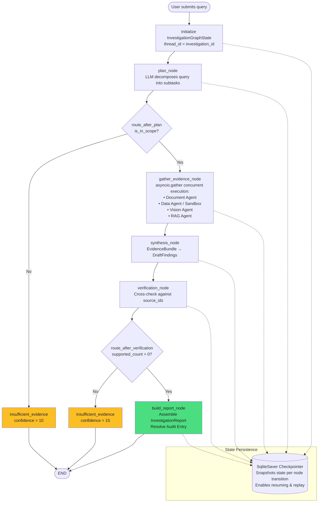

**Source references:**
- Investigation Graph: [investigation_graph.py](file:///c:/Users/HP/Desktop/SIH/KavachAI/backend/app/langgraph/graphs/investigation_graph.py)
- State Schema: [investigation_graph.py](file:///c:/Users/HP/Desktop/SIH/KavachAI/backend/app/langgraph/graphs/investigation_graph.py) (`InvestigationGraphState`)
- SQLite Checkpointer: [checkpointer.py](file:///c:/Users/HP/Desktop/SIH/KavachAI/backend/app/langgraph/checkpointer.py)

---

### 2.10 Workflow J — Human-in-the-Loop (HITL) Executive Approval Workflow

```mermaid
flowchart TD
    START_APP([Trigger Executive Briefing<br/>POST /api/v1/approvals]) --> DRAFT_N[draft_note_node<br/>render_briefing_draft<br/>Increments draft_version]
    DRAFT_N --> WAIT_N[wait_approval_node<br/>Interrupt graph execution<br/>status = pending_review]
    
    WAIT_N --> USER_ACT{Supervisor Action<br/>POST /api/v1/approvals/{id}/action}
    
    USER_ACT -->|Approve| PUB_N[publish_briefing_node<br/>Finalize official briefing note<br/>status = published] --> END_PUB([END])
    USER_ACT -->|Reject| REJ_N[Mark rejected<br/>status = rejected] --> END_REJ([END])
    USER_ACT -->|Revise with notes| REV_N[revise_draft_node<br/>Incorporate supervisor feedback<br/>status = in_revision]
    REV_N --> DRAFT_N

    style WAIT_N fill:#38bdf8,color:#1e1e1e
    style PUB_N fill:#4ade80,color:#1e1e1e
    style REJ_N fill:#f87171,color:#1e1e1e
```

**Source references:**
- Approval Graph: [approval_graph.py](file:///c:/Users/HP/Desktop/SIH/KavachAI/backend/app/langgraph/graphs/approval_graph.py)
- Approvals Router: [approval.py](file:///c:/Users/HP/Desktop/SIH/KavachAI/backend/app/routers/approval.py)
- Briefing Service: [report_service.py](file:///c:/Users/HP/Desktop/SIH/KavachAI/backend/app/services/report_service.py) (`render_briefing_draft`)

---

### 2.11 Workflow K — LangGraph ReAct Multi-Tool Chat Agent

```mermaid
flowchart TD
    USER_MSG([User sends message<br/>POST /api/v1/conversations/{id}/messages]) --> AGENT_N[agent node<br/>LLM reasoner evaluates conversation<br/>with available tools]
    
    AGENT_N --> DECIDE{Tool call required?}
    
    DECIDE -->|Yes| TOOLS_N[tools node<br/>Execute selected tool:<br/>• knowledge_base_search<br/>• equipment_status_lookup<br/>• sensor_telemetry_query]
    TOOLS_N --> AGENT_N
    
    DECIDE -->|No / Complete| RESP[Generate conversational response<br/>with exact citations] --> CHAT_END([END])

    style TOOLS_N fill:#a78bfa,color:#1e1e1e
    style RESP fill:#4ade80,color:#1e1e1e
```

**Source references:**
- Chat Graph: [chat_graph.py](file:///c:/Users/HP/Desktop/SIH/KavachAI/backend/app/langgraph/graphs/chat_graph.py)
- Chat Router: [chat.py](file:///c:/Users/HP/Desktop/SIH/KavachAI/backend/app/routers/chat.py)

---

### 2.12 Workflow L — Hardened Docker Code Sandbox Execution

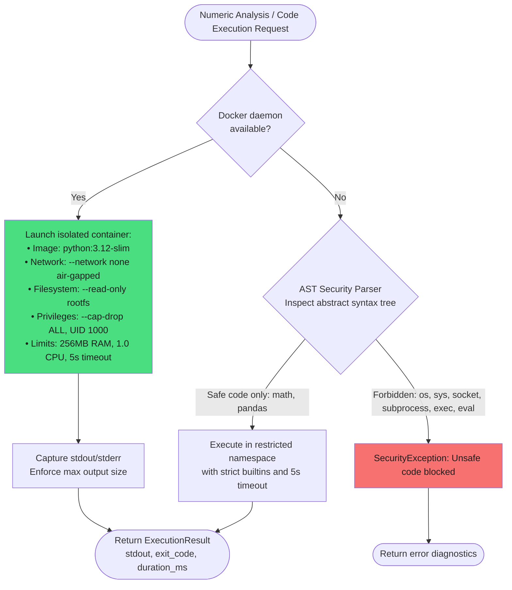

**Source references:**
- Code Sandbox Service: [code_sandbox.py](file:///c:/Users/HP/Desktop/SIH/KavachAI/backend/app/services/code_sandbox.py)
- Sandbox Test Suite: [test_code_sandbox.py](file:///c:/Users/HP/Desktop/SIH/KavachAI/backend/tests/unit/test_code_sandbox.py)

---

## 3. Data-Flow Diagrams

### 3.1 Level 0 — Context Diagram

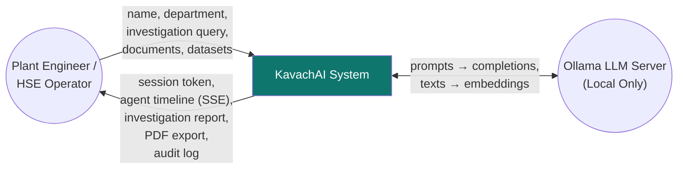

---

### 3.2 Level 1 — Internal Processes & Data Stores

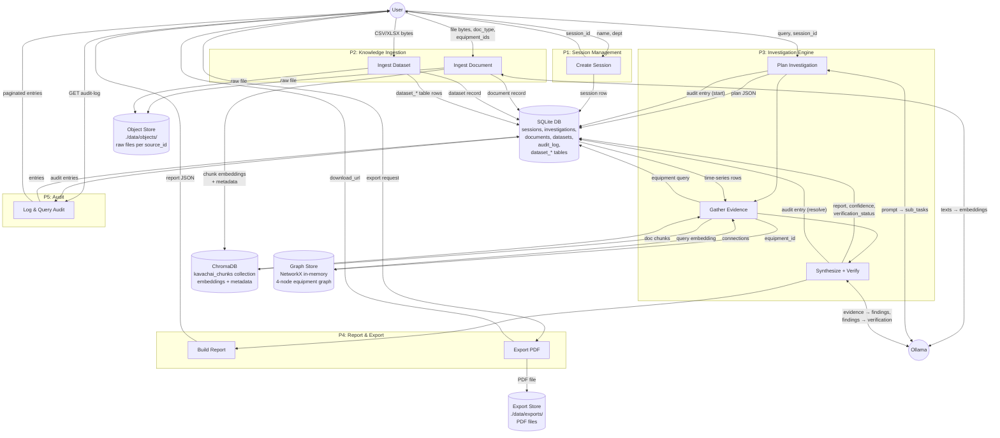

---

### 3.3 Level 2 — Investigation Evidence Gathering (Detail)

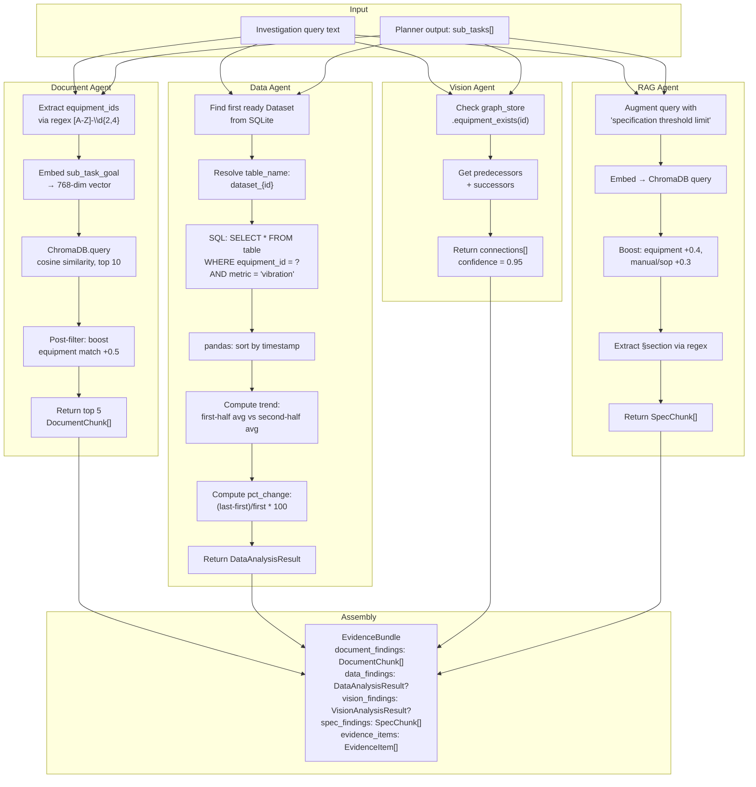

**Data labels on each edge:**

| Edge | Data Flowing |
|------|-------------|
| Query → Agents | `str` (natural language query) |
| Document Agent → ChromaDB | `List[float]` (768-dim embedding) |
| ChromaDB → Document Agent | `{chunk_id, chunk_text, source_id, page, score, metadata}` |
| Data Agent → SQLite | `SELECT * FROM dataset_XXX WHERE equipment_id=? AND metric=?` |
| SQLite → Data Agent | `pd.DataFrame` (timestamp, equipment_id, metric, value, unit) |
| Vision Agent → GraphStore | `str` (equipment_id) |
| GraphStore → Vision Agent | `List[str]` (connected equipment IDs) |
| All Agents → EvidenceBundle | Typed Pydantic models per agent contract |

---

## 4. Data Lifecycle & Security Notes

### 4.1 Sensitive Data Handled

| Data Type | Where Created | Where Stored | Sensitivity |
|-----------|--------------|-------------|-------------|
| User name + department | Session creation | SQLite `sessions` table, browser `sessionStorage` | Low — demo-grade, no passwords |
| Investigation queries | User input | SQLite `investigations.query`, `audit_log.query` | Medium — reveals plant concerns |
| Raw documents (PDFs, DOCX) | File upload | `./data/objects/{source_id}/` filesystem | High — proprietary plant data |
| Telemetry data | CSV upload | SQLite `dataset_*` tables | High — operational metrics |
| LLM prompts/responses | Investigation pipeline | Transient (in-memory only) | Medium — contain evidence excerpts |
| Audit log | Auto-generated | SQLite `audit_log` table | Medium — who queried what |

### 4.2 Authentication & Authorization Boundaries

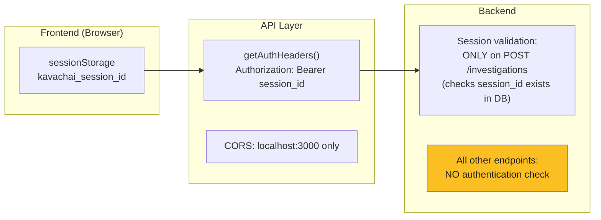

> [!WARNING]
> **No real authentication exists.** The `session_id` is stored in `sessionStorage` and sent as a Bearer token, but the backend only validates it on `POST /investigations` (line 88-94 of [investigations.py](file:///c:/Users/HP/Desktop/SIH/KavachAI/backend/app/routers/investigations.py#L88-L94)). All other endpoints (knowledge-base, evidence, export, audit) have **zero auth checks**. The `deps.py` file is a placeholder with no actual dependencies implemented.

### 4.3 Data Persistence Locations

| Store | Technology | Path | Persistence |
|-------|-----------|------|-------------|
| Relational data | SQLite (async via aiosqlite) | `./data/kavachai.db` | Persistent, WAL mode |
| Vector embeddings | ChromaDB (PersistentClient) | `./data/chroma/` | Persistent, HNSW cosine (887 chunks: demo + MRPL statutory) |
| Raw source files | Local filesystem | `./data/objects/{source_id}/` | Persistent |
| MRPL Reference Corpus | Local filesystem + ChromaDB | `./data/mrpl_public/` | Persistent (382-page annual report, sha256 verified) |
| Equipment graph | NetworkX (in-memory) | N/A | Hybrid — runtime extensible with pre-loaded 7-node chain |
| LangGraph State Checkpointer | SQLite (`SqliteSaver`) | `./data/kavachai.db` / memory | Persistent graph thread state per investigation/approval |
| PDF exports | Local filesystem | `./data/exports/` | Persistent |
| Investigation runners | Python dict + LangGraph state | In-memory + SQLite checkpointer | Resilient across SSE disconnects |
| Session data (frontend) | Browser sessionStorage | N/A | Per-tab, cleared on tab close |

### 4.4 External Data Sharing & Egress Control

> [!IMPORTANT]
> **Zero external data transmission by design (NFR-SEC-1).** All LLM inference runs through the local Ollama server at `localhost:11434`. The `ModelRouter` is the single chokepoint — no agent imports `httpx` or calls any external endpoint directly. Dynamic code execution runs inside a Docker sandbox with `--network none` (verified by `test_egress_monitor.py` and `test_code_sandbox.py`). ChromaDB telemetry is explicitly disabled (`anonymized_telemetry=False`).

### 4.5 Security Architecture & Hardening Status

| # | Category | Previous Risk / Requirement | Resolution / Current Status | Severity | Source |
|---|----------|----------------------------|-----------------------------|----------|--------|
| 1 | **Code Sandbox** | Unconstrained script/math execution risk | **Resolved**: Docker container sandbox (`python:3.12-slim`) with `--network none`, `--read-only`, non-root UID 1000, 256MB RAM limit, 1.0 CPU limit, 5s timeout, plus AST forbidden module blocker (`os`, `sys`, `subprocess`, `socket`). | 🟢 Mitigated | [code_sandbox.py](file:///c:/Users/HP/Desktop/SIH/KavachAI/backend/app/services/code_sandbox.py) |
| 2 | **Egress Control** | Risk of outbound data leaks from tools | **Resolved**: `egress_monitor` audit verifies zero outbound requests; all model requests strictly channeled through local `ModelRouter`. | 🟢 Mitigated | [test_egress_monitor.py](file:///c:/Users/HP/Desktop/SIH/KavachAI/backend/tests/unit/test_egress_monitor.py) |
| 3 | **Multi-Tenancy & Schema** | Duplicate `session_id` column in `sql_models.py` | **Resolved**: Cleaned schema definition in `sql_models.py` and validated session ownership enforcement in `test_session_ownership.py`. | 🟢 Fixed | [sql_models.py](file:///c:/Users/HP/Desktop/SIH/KavachAI/backend/app/db/sql_models.py) |
| 4 | **OCR Degraded Docs** | Scanned plant logs & PDFs without text layers | **Resolved**: 4-Tier OCR pipeline in `extract.py` combining PyMuPDF native extraction, density thresholding, local Tesseract OCR at 300 DPI, and Qwen2.5-VL visual OCR fallback. | 🟢 Mitigated | [extract.py](file:///c:/Users/HP/Desktop/SIH/KavachAI/backend/app/ingestion/extract.py) |
| 5 | **HITL Governance** | Unchecked AI briefing note publication | **Resolved**: LangGraph Human-in-the-Loop approval graph (`approval_graph.py`) enforcing supervisor review, multi-version tracking (`draft_version`), and interruptible execution. | 🟢 Mitigated | [approval_graph.py](file:///c:/Users/HP/Desktop/SIH/KavachAI/backend/app/langgraph/graphs/approval_graph.py) |
| 6 | **State Resilience** | Investigation runner in-memory state loss | **Improved**: LangGraph `SqliteSaver` checkpointer serializes graph state at each node transition, allowing state inspection and resumption. | 🟢 Mitigated | [checkpointer.py](file:///c:/Users/HP/Desktop/SIH/KavachAI/backend/app/langgraph/checkpointer.py) |

---

## 5. Architecture Findings Summary

### Main Flows

| Flow | Trigger | Key Components | Terminal States |
|------|---------|----------------|-----------------|
| **Session** | User login | Frontend → Session Router → SQLite | Session created |
| **Doc Ingestion** | File upload / Script | Router → 4-Tier OCR (`extract.py`) → Chunk → Tag → Embed → ChromaDB | ready / failed |
| **Dataset Ingestion** | CSV upload | Router → pandas → TabularStore → SQLite table | ready / failed |
| **MRPL Reference Corpus** | Public statutory sync | `ingest_mrpl_public.py` → PDF Extract → Tagging → Vector Store (859 chunks) | ready (persisted) |
| **Investigation (Legacy)** | Query submit | Router → BackgroundTasks → Planner → [Doc∥Data∥Vision] → RAG → Synthesis → Verification → Report | complete / insufficient_evidence / failed |
| **Investigation (LangGraph)** | Query submit | Router → LangGraph StateGraph (`plan` → `gather` → `synth` → `verif` → `report`) + SQLite checkpointer | complete / insufficient_evidence |
| **Executive Approval (HITL)** | Briefing request | Approval Router → LangGraph Approval Graph (`draft` → `wait_approval` → `revise` / `publish`) | published / rejected |
| **ReAct Chat Agent** | User prompt | Chat Router → LangGraph ReAct Graph (`agent` ↔ `tools` loop) | complete response with citations |
| **Sandboxed Execution** | Data analysis sub-task | Data Agent → `DockerCodeSandbox` (`--network none`, `--read-only`, AST fallback) | ExecutionResult |
| **SSE Stream** | Frontend EventSource | Polling `_runners.events[]` + DB status check | investigation_complete / insufficient_evidence |
| **Export** | Export button | Router → ReportLab PDF / DOCX generator → FileResponse | File download |
| **Audit** | Auto (investigation lifecycle) | Two-write: create on start, resolve on end | Append-only read via GET |

### Key Dependencies

| Dependency | Role | Required? |
|-----------|------|-----------|
| **LangGraph (≥0.4.8)** | StateGraph orchestration, multi-agent loops, HITL approval | Yes |
| **langgraph-checkpoint-sqlite** | SQLite state persistence and node checkpointing | Yes |
| **Ollama (Qwen 2.5 3B)** | Text reasoning, planning, synthesis, verification, chat | No — offline fallback exists |
| **Ollama (Qwen 2.5-VL 3B)** | Multimodal P&ID drawing inspection and Tier-4 visual OCR | No — NetworkX fallback exists |
| **Ollama (nomic-embed-text)** | 768-dim embeddings for vector search | No — pseudo-embed fallback exists |
| **SQLite + aiosqlite** | Primary relational store and checkpointer | Yes |
| **ChromaDB** | Vector similarity search (stores demo + 859 MRPL statutory chunks) | Yes |
| **PyMuPDF (fitz)** | PDF text extraction, 300 DPI image rendering for OCR & vision | Yes |
| **pytesseract** | Tier-3 local OCR for scanned industrial documents | Optional (graceful fallback) |
| **Docker SDK** | Isolated code execution sandbox (`--network none`, non-root) | Optional (AST fallback) |
| **NetworkX** | Equipment relationship graph and cycle-safe topology traversal | Yes |
| **ReportLab / python-docx** | Branded PDF and DOCX export generation | Yes |

### Current Test Suite Verification Status
```text
174 passed, 1 skipped, 0 failed in 9.81s
```
* **Investigation Graph Tests**: 20 passed ([test_investigation_graph.py](file:///c:/Users/HP/Desktop/SIH/KavachAI/backend/tests/unit/test_investigation_graph.py))
* **Approval Graph Tests**: 12 passed ([test_approval_graph.py](file:///c:/Users/HP/Desktop/SIH/KavachAI/backend/tests/unit/test_approval_graph.py))
* **Chat Graph Tests**: 6 passed ([test_chat_graph.py](file:///c:/Users/HP/Desktop/SIH/KavachAI/backend/tests/unit/test_chat_graph.py))
* **Tiered OCR Pipeline Tests**: 11 passed ([test_ocr_pipeline.py](file:///c:/Users/HP/Desktop/SIH/KavachAI/backend/tests/unit/test_ocr_pipeline.py))
* **Docker Code Sandbox Tests**: 13 passed ([test_code_sandbox.py](file:///c:/Users/HP/Desktop/SIH/KavachAI/backend/tests/unit/test_code_sandbox.py))
* **Core Agent & Model Routing Tests**: 112 passed (Session ownership, egress monitor, planners, agents, exporters)
