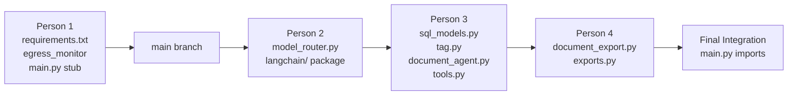

# KavachAI — Team Implementation Plans (Phases 1 & 2)
## Conflict-Free Parallel Work for 4 Developers

> **Strategy**: Each person owns **exclusive files** — no two people touch the same file. Where a shared file *must* be touched (e.g., `requirements.txt`, `main.py`), only **one person** is responsible; others wait for their merge first. Any unavoidable overlap uses **additive-only** changes (appending imports, adding new dict keys) so both sides are accepted in an "accept both" merge.

---

## File Ownership Matrix

| File | Owner | Action |
|------|-------|--------|
| `backend/requirements.txt` | **Person 1** | MODIFY (sole owner) |
| `backend/app/middleware/__init__.py` | **Person 1** | NEW |
| `backend/app/middleware/egress_monitor.py` | **Person 1** | NEW |
| `backend/app/orchestrator/model_router.py` | **Person 2** | MODIFY (sole owner) |
| `backend/app/langchain/__init__.py` | **Person 2** | NEW |
| `backend/app/langchain/model_adapter.py` | **Person 2** | NEW |
| `backend/app/langchain/prompts.py` | **Person 2** | NEW |
| `backend/app/db/sql_models.py` | **Person 3** | MODIFY (sole owner) |
| `backend/app/ingestion/tag.py` | **Person 3** | MODIFY (sole owner) |
| `backend/app/agents/document_agent.py` | **Person 3** | MODIFY (sole owner) |
| `backend/app/langchain/tools.py` | **Person 3** | NEW |
| `backend/app/services/document_export.py` | **Person 4** | NEW |
| `backend/app/routers/exports.py` | **Person 4** | NEW |
| `backend/app/main.py` | **Person 1** | MODIFY (final integrator) |

> [!IMPORTANT]
> **Merge Order**: Person 1 → Person 2 → Person 3 → Person 4. Each person's changes are **additive** to the file they own. When merging `main.py` at the end, Person 1 integrates all router registrations — this is a simple "accept both" (appending `app.include_router(...)` lines and imports).

---

## 🔀 Handling the Shared Touchpoints

These are the **only** places where two people's work converges on a single file:

### 1. `backend/app/main.py` — Import Lines
Each person adds their own import line. These are **non-overlapping additive lines**:
```python
# Person 1 adds:
from app.middleware.egress_monitor import egress_monitor

# Person 2 adds:  (no main.py touch needed — their module is imported by Person 3's tools.py)

# Person 3 adds:  (no main.py touch — tools.py is imported by graph files in Phase 3)

# Person 4 adds:
from app.routers import exports
app.include_router(exports.router)
```

**Conflict resolution**: "Accept Both" — each import and `include_router` line is distinct and non-overlapping.

### 2. `backend/requirements.txt` — Person 1 owns entirely
Person 1 adds ALL new dependencies in one commit. Others do not touch this file.

---

# 👤 Person 1 — Infrastructure & Egress Monitor

**Scope**: System dependencies, egress monitoring middleware, and final `main.py` integration.

**Exclusive Files**:
- `backend/requirements.txt` (MODIFY)
- `backend/app/middleware/__init__.py` (NEW)
- `backend/app/middleware/egress_monitor.py` (NEW)
- `backend/app/main.py` (MODIFY — only for egress + lifespan wiring)

**Estimated Time**: 1 day

---

### Task 1.1 — Update Dependencies

#### [MODIFY] [requirements.txt](file:///c:/Users/HP/Desktop/SIH/KavachAI/backend/requirements.txt)

Add all new dependencies for the entire team (Person 1 is sole owner of this file):

```diff
 # Core
 fastapi>=0.115.0
 uvicorn[standard]>=0.30.0
 pydantic>=2.9.0
 pydantic-settings>=2.5.0
 python-dotenv>=1.0.0
 python-multipart>=0.0.9
 
 # Database
 sqlalchemy>=2.0.0
 aiosqlite>=0.20.0
 chromadb>=0.5.0
+alembic>=1.13.0
 
+# LangGraph & LangChain (Orchestration Engine - Tested 0.3/0.4 Lock Set)
+langchain==0.3.25
+langchain-core>=0.3.30
+langgraph==0.4.8
+langgraph-checkpoint-sqlite>=2.0.0
 
 # LLM / Embeddings
 httpx>=0.27.0
 
 # Document Processing & OCR
 PyMuPDF>=1.24.0
+pytesseract>=0.3.10
+easyocr>=1.7.0
+Pillow>=10.0.0
 python-docx>=1.1.0
 openpyxl>=3.1.0
+python-pptx>=0.6.23
 
 # Data Analytics
 pandas>=2.2.0
 
 # Graph
 networkx>=3.3
 
 # PDF Export
 reportlab>=4.2.0
 
 # SSE
 sse-starlette>=2.1.0
 
 # Testing
 pytest>=8.3.0
 pytest-asyncio>=0.24.0
```

---

### Task 1.2 — Egress Monitoring Middleware

#### [NEW] [backend/app/middleware/__init__.py](file:///c:/Users/HP/Desktop/SIH/KavachAI/backend/app/middleware/__init__.py)
```python
# Middleware package
```

#### [NEW] [backend/app/middleware/egress_monitor.py](file:///c:/Users/HP/Desktop/SIH/KavachAI/backend/app/middleware/egress_monitor.py)

```python
import socket
from urllib.parse import urlparse
from pydantic import BaseModel
from datetime import datetime

class EgressEntry(BaseModel):
    destination: str
    classification: str
    method: str
    path: str
    latency_ms: float
    port: int
    timestamp: str
    model_used: str | None

class EgressMonitor:
    LOCAL_HOSTS = {"localhost", "127.0.0.1"}
    DEPLOYMENT_EXCEPTIONS = {"ollama", "host.docker.internal"}

    def __init__(self):
        self.logs: list[EgressEntry] = []
        self._attempted_connections = 0

    def validate_ollama_host(self, ollama_host: str):
        parsed = urlparse(ollama_host)
        host = parsed.hostname or ""
        if host not in self.LOCAL_HOSTS and host not in self.DEPLOYMENT_EXCEPTIONS:
            raise RuntimeError(f"SOVEREIGNTY VIOLATION: OLLAMA_HOST={ollama_host} is not local.")
        try:
            resolved_ip = socket.gethostbyname(host)
            if not resolved_ip.startswith("127.") and resolved_ip != "::1":
                raise RuntimeError(f"OLLAMA_HOST resolves to {resolved_ip}, not loopback.")
        except socket.gaierror:
            pass

    def install_socket_audit(self):
        if getattr(socket.getaddrinfo, "_kavach_patched", False):
            return
        original = socket.getaddrinfo
        monitor = self

        def audited(host, port, *a, **kw):
            monitor._attempted_connections += 1
            is_local = str(host) in monitor.LOCAL_HOSTS or str(host).startswith("127.")
            monitor.logs.append(EgressEntry(
                destination=f"{host}:{port}",
                classification="LOCAL_ALLOWED" if is_local else "EXTERNAL_RECORDED",
                method="DNS_LOOKUP",
                path="socket.getaddrinfo",
                latency_ms=0, port=port or 0,
                timestamp=datetime.utcnow().isoformat(),
                model_used=None,
            ))
            return original(host, port, *a, **kw)

        audited._kavach_patched = True
        socket.getaddrinfo = audited

egress_monitor = EgressMonitor()
```

---

### Task 1.3 — Main.py Lifespan Wiring (Egress Only)

#### [MODIFY] [backend/app/main.py](file:///c:/Users/HP/Desktop/SIH/KavachAI/backend/app/main.py)

Person 1 adds **only** the egress monitor import and call inside the existing lifespan. Other people's integrations (routers, graphs) are merged later as additive imports:

```python
# Person 1 adds these lines to the lifespan function:
from app.middleware.egress_monitor import egress_monitor

# Inside lifespan(), after init_db():
egress_monitor.install_socket_audit()
```

> [!TIP]
> Person 1 should leave a `# TODO: LangGraph checkpointer init goes here (Phase 3)` comment so the Phase 3 integrator knows where to wire graphs.

---

### Task 1.4 — Unit Tests

#### [NEW] [backend/tests/unit/test_egress_monitor.py](file:///c:/Users/HP/Desktop/SIH/KavachAI/backend/tests/unit/test_egress_monitor.py)

Test cases:
- `test_local_ollama_host_passes()` — valid `http://localhost:11434`
- `test_external_host_raises()` — `http://api.openai.com` raises `RuntimeError`
- `test_socket_audit_logs_connections()` — after `install_socket_audit()`, a `socket.getaddrinfo("localhost", 80)` call appears in `.logs`
- `test_audit_idempotent()` — calling `install_socket_audit()` twice doesn't double-patch

---

### ✅ Person 1 Done Criteria
- [ ] `pip install -r requirements.txt` succeeds with all new packages
- [ ] `EgressMonitor` logs local connections and raises on external Ollama hosts
- [ ] `main.py` lifespan calls `install_socket_audit()` on startup
- [ ] All tests in `test_egress_monitor.py` pass

---
---

# 👤 Person 2 — LLM Adapter & Model Router Extension

**Scope**: The `KavachLLM` LangChain adapter and the `generate_chat_with_tools()` method on ModelRouter.

**Exclusive Files**:
- `backend/app/orchestrator/model_router.py` (MODIFY — sole owner)
- `backend/app/langchain/__init__.py` (NEW)
- `backend/app/langchain/model_adapter.py` (NEW)
- `backend/app/langchain/prompts.py` (NEW)

**Estimated Time**: 1.5 days

---

### Task 2.1 — ModelRouter: Add `generate_chat_with_tools()`

#### [MODIFY] [model_router.py](file:///c:/Users/HP/Desktop/SIH/KavachAI/backend/app/orchestrator/model_router.py)

> [!IMPORTANT]
> **`generate_chat()` remains untouched.** Only add a new method — zero risk to existing callers.

```python
    # NEW METHOD — append after existing generate_chat():
    async def generate_chat_with_tools(
        self,
        messages: List[Dict[str, Any]],
        tools: List[Dict[str, Any]],
        task_type: str = "text_reasoning",
        temperature: float = 0.1,
        max_tokens: int = 2048,
    ) -> Dict[str, Any]:
        """
        Chat generation with native Ollama tool-calling.
        Returns: {"content": str, "tool_calls": Optional[List[Dict]]}
        """
        model = self.get_model(task_type)
        payload = {
            "model": model,
            "messages": messages,
            "stream": False,
            "options": {"temperature": temperature, "num_predict": max_tokens},
            "tools": tools,
        }
        resp = await self._client.post("/api/chat", json=payload)
        resp.raise_for_status()
        data = resp.json()
        msg = data.get("message", {})
        return {
            "content": msg.get("content", ""),
            "tool_calls": msg.get("tool_calls"),
        }
```

---

### Task 2.2 — LangChain Package Init

#### [NEW] [backend/app/langchain/__init__.py](file:///c:/Users/HP/Desktop/SIH/KavachAI/backend/app/langchain/__init__.py)
```python
# LangChain adapter package for KavachAI
```

---

### Task 2.3 — KavachLLM Adapter with Native `tool_name`

#### [NEW] [backend/app/langchain/model_adapter.py](file:///c:/Users/HP/Desktop/SIH/KavachAI/backend/app/langchain/model_adapter.py)

Full implementation as specified in the master plan (Section 1.3). Key requirements:
- `_convert_messages()` maps `ToolMessage` → `{"role": "tool", "content": ..., "tool_name": m.name}`
- `bind_tools()` returns a new `KavachLLM` instance with tool schemas
- `_agenerate()` calls `model_router.generate_chat_with_tools()` when tools are bound, else `generate_chat()`
- Exports `get_reasoning_llm()` and `get_coding_llm()` factory functions

```python
from typing import Any, List, Optional
from langchain_core.language_models.chat_models import BaseChatModel
from langchain_core.messages import (
    BaseMessage, AIMessage, HumanMessage, SystemMessage, ToolMessage
)
from langchain_core.outputs import ChatResult, ChatGeneration

ROLE_MAP = {
    "human": "user",
    "ai": "assistant",
    "system": "system",
    "tool": "tool",
    "user": "user",
    "assistant": "assistant",
}

class KavachLLM(BaseChatModel):
    task_type: str = "text_reasoning"
    _tools: list = []

    @property
    def _llm_type(self) -> str:
        return "kavach-local-ollama"

    def _convert_messages(self, messages: List[BaseMessage]) -> List[dict]:
        result = []
        for m in messages:
            role = ROLE_MAP.get(m.type, "user")
            msg = {"role": role, "content": str(m.content)}
            
            # AIMessage with tool_calls
            if hasattr(m, "tool_calls") and m.tool_calls:
                msg["tool_calls"] = [
                    {"function": {"name": tc["name"], "arguments": tc["args"]}}
                    for tc in m.tool_calls
                ]
            
            # ToolMessage: must pass tool_name per Ollama native API
            if m.type == "tool":
                tool_name = getattr(m, "name", None) or getattr(m, "tool_name", "")
                msg["tool_name"] = tool_name
                msg["name"] = tool_name

            result.append(msg)
        return result

    def _convert_tool_schema(self, lc_tool) -> dict:
        schema = lc_tool.args_schema.schema() if hasattr(lc_tool, 'args_schema') else {}
        return {
            "type": "function",
            "function": {
                "name": lc_tool.name,
                "description": lc_tool.description or "",
                "parameters": {
                    "type": "object",
                    "properties": schema.get("properties", {}),
                    "required": schema.get("required", []),
                },
            },
        }

    def bind_tools(self, tools: list, **kwargs) -> "KavachLLM":
        bound = KavachLLM(task_type=self.task_type)
        bound._tools = [self._convert_tool_schema(t) for t in tools]
        return bound

    async def _agenerate(self, messages: List[BaseMessage], stop: Optional[List[str]] = None, **kwargs) -> ChatResult:
        from app.orchestrator.model_router import model_router
        ollama_messages = self._convert_messages(messages)

        if self._tools:
            res = await model_router.generate_chat_with_tools(
                messages=ollama_messages,
                tools=self._tools,
                task_type=self.task_type,
                temperature=kwargs.get("temperature", 0.1),
                max_tokens=kwargs.get("max_tokens", 2048),
            )
            content = res.get("content", "")
            raw_tool_calls = res.get("tool_calls")
            if raw_tool_calls:
                lc_tool_calls = [
                    {
                        "name": tc.get("function", {}).get("name", ""),
                        "args": tc.get("function", {}).get("arguments", {}),
                        "id": f"call_{tc.get('function', {}).get('name', '')}_{i}",
                    }
                    for i, tc in enumerate(raw_tool_calls)
                ]
                ai_msg = AIMessage(content=content or "", tool_calls=lc_tool_calls)
            else:
                ai_msg = AIMessage(content=content or "")
        else:
            text = await model_router.generate_chat(
                messages=[{"role": m["role"], "content": m["content"]} for m in ollama_messages],
                task_type=self.task_type,
                temperature=kwargs.get("temperature", 0.1),
                max_tokens=kwargs.get("max_tokens", 2048),
            )
            ai_msg = AIMessage(content=text or "")

        return ChatResult(generations=[ChatGeneration(message=ai_msg)])

    def _generate(self, messages: List[BaseMessage], stop: Optional[List[str]] = None, **kwargs) -> ChatResult:
        import asyncio
        return asyncio.run(self._agenerate(messages, stop=stop, **kwargs))

def get_reasoning_llm() -> KavachLLM:
    return KavachLLM(task_type="text_reasoning")

def get_coding_llm() -> KavachLLM:
    return KavachLLM(task_type="coding")
```

---

### Task 2.4 — Prompts Module

#### [NEW] [backend/app/langchain/prompts.py](file:///c:/Users/HP/Desktop/SIH/KavachAI/backend/app/langchain/prompts.py)

System prompts and instructions for different agent personas. This file is **new** and exclusively owned by Person 2:

```python
# Agent system prompts for KavachAI investigation workflows

INVESTIGATION_SYSTEM_PROMPT = """You are KavachAI, a sovereign AI investigation assistant.
You operate fully offline using local models. You help defense and PSU officers
conduct root-cause analysis on equipment failures and operational incidents.
Always cite document sources and data evidence."""

CHAT_SYSTEM_PROMPT = """You are KavachAI Chat, a helpful assistant for defense/PSU organizations.
Use the available tools to search documents and analyze operational data.
Always ground your answers in evidence from the knowledge base."""

DATA_ANALYSIS_PROMPT = """Analyze the operational telemetry data for the specified equipment.
Focus on trend detection, threshold breaches, and anomaly identification.
Report findings with specific metric values and time ranges."""
```

---

### Task 2.5 — Unit Tests

#### [NEW] [backend/tests/unit/test_model_routing.py](file:///c:/Users/HP/Desktop/SIH/KavachAI/backend/tests/unit/test_model_routing.py)

Test cases:
- `test_generate_chat_returns_string()` — existing method still returns `str`
- `test_generate_chat_with_tools_returns_dict()` — new method returns `{"content": ..., "tool_calls": ...}`
- `test_kavach_llm_converts_tool_message_with_tool_name()` — `ToolMessage` includes `tool_name` in output
- `test_kavach_llm_bind_tools_returns_new_instance()` — `bind_tools()` creates new LLM, doesn't mutate original
- `test_kavach_llm_without_tools_uses_generate_chat()` — fallback to text-only path

---

### ✅ Person 2 Done Criteria
- [ ] `generate_chat()` signature and return type unchanged — backward compatible
- [ ] `generate_chat_with_tools()` sends `tools` payload and returns parsed `tool_calls`
- [ ] `KavachLLM._convert_messages()` maps `ToolMessage` → `tool_name` key
- [ ] `bind_tools()` returns isolated new instance with schema
- [ ] `get_reasoning_llm()` and `get_coding_llm()` return correctly configured instances
- [ ] All tests in `test_model_routing.py` pass

---
---

# 👤 Person 3 — Session Ownership & Tool Definitions

**Scope**: End-to-end `session_id` ownership across DB models, vector store ingestion, document retrieval, and LangChain tool definitions.

**Exclusive Files**:
- `backend/app/db/sql_models.py` (MODIFY — sole owner)
- `backend/app/ingestion/tag.py` (MODIFY — sole owner)
- `backend/app/agents/document_agent.py` (MODIFY — sole owner)
- `backend/app/langchain/tools.py` (NEW)

**Depends on**: Person 2's `langchain/` package `__init__.py` existing (but no code dependency — Person 3 creates `tools.py` inside the same package as an additive new file).

**Estimated Time**: 1.5 days

---

### Task 3.1 — Database Models: Add `session_id`

#### [MODIFY] [sql_models.py](file:///c:/Users/HP/Desktop/SIH/KavachAI/backend/app/db/sql_models.py)

Add `session_id` foreign key to `Document` and `Dataset` models:

```python
# Add to Document model:
session_id = Column(String, ForeignKey("sessions.id"), nullable=True)

# Add to Dataset model:
session_id = Column(String, ForeignKey("sessions.id"), nullable=True)
```

> [!NOTE]
> This is an **additive** column addition. No existing columns are modified. Run `alembic revision --autogenerate` after to create the migration.

---

### Task 3.2 — Ingestion: Tag Chunks with `session_id`

#### [MODIFY] [tag.py](file:///c:/Users/HP/Desktop/SIH/KavachAI/backend/app/ingestion/tag.py)

Add `session_id` parameter to `tag_chunks()`:

```python
def tag_chunks(
    chunks: List[Dict[str, Any]],
    source_id: str,
    filename: str,
    document_type: str,
    equipment_ids: Optional[List[str]] = None,
    department_scope: Optional[str] = None,
    session_id: Optional[str] = None,  # NEW
) -> List[Dict[str, Any]]:
    # ... existing logic ...
    metadata = {
        "source_id": source_id,
        "filename": filename,
        "session_id": session_id or "",  # NEW: written into ChromaDB metadata
        # ... rest of existing metadata fields ...
    }
```

> [!NOTE]
> The new parameter has a default of `None`, so **all existing callers continue to work unchanged**.

---

### Task 3.3 — Document Retrieval: Filter by `session_id`

#### [MODIFY] [document_agent.py](file:///c:/Users/HP/Desktop/SIH/KavachAI/backend/app/agents/document_agent.py)

Add session-aware filtering in `_build_where_filter()`:

```python
if "session_id" in filters and filters["session_id"]:
    # Include documents uploaded in this session OR shared corpus documents
    conditions.append({"session_id": {"$in": [filters["session_id"], "", "shared", "corpus"]}})
```

---

### Task 3.4 — LangChain Tool Definitions

#### [NEW] [backend/app/langchain/tools.py](file:///c:/Users/HP/Desktop/SIH/KavachAI/backend/app/langchain/tools.py)

```python
from langchain_core.tools import tool
from langchain_core.runnables import RunnableConfig
from sqlalchemy import select, or_
from app.db.database import async_session
from app.db.sql_models import Dataset
from app.agents import document_agent, data_agent

@tool("search_local_documents")
async def search_local_documents(query: str, config: RunnableConfig) -> str:
    """Search organization knowledge base filtered by session."""
    session_id = config.get("configurable", {}).get("session_id")
    chunks = await document_agent.retrieve(
        sub_task_goal=query,
        filters={"session_id": session_id} if session_id else None,
        n_results=5,
    )
    if not chunks:
        return "No relevant documents found in knowledge base."
    return "\n\n".join(f"[{c.source_id} p.{c.page}]: {c.chunk_text[:300]}" for c in chunks)

@tool("analyze_operational_data")
async def analyze_operational_data(
    metric: str, equipment_id: str, dataset_id: str, config: RunnableConfig
) -> str:
    """Run deterministic pandas statistical analysis on a specific dataset."""
    session_id = config.get("configurable", {}).get("session_id")
    # Verify dataset exists and belongs to this session (or is shared)
    async with async_session() as db:
        query = select(Dataset).where(
            Dataset.id == dataset_id,
            or_(Dataset.session_id == session_id, Dataset.session_id.is_(None), Dataset.session_id == "")
        )
        res = await db.execute(query)
        dataset = res.scalar_one_or_none()
        if not dataset:
            return f"Error: Dataset '{dataset_id}' not found or unauthorized for this session."

    result = data_agent.analyze(metric=metric, equipment_id=equipment_id, dataset_id=dataset_id)
    if not result.data_points:
        return f"No telemetry points found for metric '{metric}' on equipment '{equipment_id}'."
    return (
        f"Equipment: {equipment_id}, Metric: {metric}\n"
        f"Trend: {result.trend.value}, Change: {result.pct_change:+.1f}%\n"
        f"Points Sampled: {len(result.data_points)}\n"
        f"Breached Threshold: {result.threshold_breach}"
    )

ALL_TOOLS = [search_local_documents, analyze_operational_data]
```

---

### Task 3.5 — Unit Tests

#### [NEW] [backend/tests/unit/test_session_ownership.py](file:///c:/Users/HP/Desktop/SIH/KavachAI/backend/tests/unit/test_session_ownership.py)

Test cases:
- `test_document_model_has_session_id()` — column exists and is nullable
- `test_dataset_model_has_session_id()` — column exists and is nullable
- `test_tag_chunks_includes_session_id_in_metadata()` — tagged chunks contain `session_id` key
- `test_tag_chunks_default_session_id_is_empty()` — omitting param defaults to `""`
- `test_document_retrieval_filters_by_session()` — retrieval includes session + shared docs
- `test_tool_validates_dataset_ownership()` — `analyze_operational_data` rejects cross-session access

---

### ✅ Person 3 Done Criteria
- [ ] `Document` and `Dataset` models have `session_id` FK column
- [ ] `tag_chunks()` writes `session_id` into ChromaDB metadata
- [ ] `document_agent.retrieve()` filters by `session_id` and includes shared corpus
- [ ] `search_local_documents` tool passes `session_id` from `RunnableConfig`
- [ ] `analyze_operational_data` tool validates dataset ownership before analysis
- [ ] All tests in `test_session_ownership.py` pass

---
---

# 👤 Person 4 — Document Export Service (Phase 2)

**Scope**: Pure Python generation of officer deliverables (`.docx`, `.xlsx`, `.pptx`) and the export API endpoints.

**Exclusive Files**:
- `backend/app/services/document_export.py` (NEW)
- `backend/app/routers/exports.py` (NEW)

**No dependencies** on other people's code — uses only existing DB models and services.

**Estimated Time**: 1.5 days

---

### Task 4.1 — Document Export Service

#### [NEW] [backend/app/services/document_export.py](file:///c:/Users/HP/Desktop/SIH/KavachAI/backend/app/services/document_export.py)

Generates mission-critical officer deliverables in three formats:

```python
import os
from datetime import datetime
from typing import Dict, Any, List, Optional

# --- DOCX: Executive Briefing Note ---
async def generate_briefing_docx(investigation_id: str, content: str) -> str:
    """
    Generate .docx Executive Briefing Note with:
    - Standard defense/PSU header formatting
    - Classification markings
    - Signature blocks for approving officers
    - Numbered findings with evidence citations
    """
    from docx import Document
    from docx.shared import Inches, Pt
    from docx.enum.text import WD_ALIGN_PARAGRAPH
    
    doc = Document()
    
    # Title
    title = doc.add_heading("Executive Briefing Note", level=1)
    title.alignment = WD_ALIGN_PARAGRAPH.CENTER
    
    # Classification header
    p = doc.add_paragraph()
    p.alignment = WD_ALIGN_PARAGRAPH.CENTER
    run = p.add_run("CONFIDENTIAL — FOR OFFICIAL USE ONLY")
    run.bold = True
    run.font.size = Pt(10)
    
    # Metadata
    doc.add_paragraph(f"Investigation ID: {investigation_id}")
    doc.add_paragraph(f"Date: {datetime.now().strftime('%d %B %Y')}")
    doc.add_paragraph(f"Generated by: KavachAI Sovereign Intelligence System")
    
    doc.add_paragraph("─" * 60)
    
    # Content body
    doc.add_heading("Findings", level=2)
    doc.add_paragraph(content)
    
    # Signature block
    doc.add_paragraph("")
    doc.add_paragraph("─" * 40)
    doc.add_paragraph("Approving Officer Signature")
    doc.add_paragraph("Name: _________________________")
    doc.add_paragraph("Designation: ___________________")
    doc.add_paragraph(f"Date: {datetime.now().strftime('%d/%m/%Y')}")
    
    output_dir = f"data/exports/{investigation_id}"
    os.makedirs(output_dir, exist_ok=True)
    filepath = f"{output_dir}/briefing_note.docx"
    doc.save(filepath)
    return filepath


# --- XLSX: Incident Log & Telemetry Matrix ---
async def generate_incident_xlsx(investigation_id: str, findings: Dict[str, Any]) -> str:
    """
    Generate .xlsx Incident Log with:
    - Column formatting and auto-width
    - Conditional fills for severity levels
    - Telemetry data matrix sheet
    """
    from openpyxl import Workbook
    from openpyxl.styles import PatternFill, Font, Alignment
    
    wb = Workbook()
    
    # Sheet 1: Incident Log
    ws = wb.active
    ws.title = "Incident Log"
    
    headers = ["#", "Finding", "Severity", "Evidence Source", "Recommendation"]
    header_fill = PatternFill(start_color="1F4E79", end_color="1F4E79", fill_type="solid")
    header_font = Font(color="FFFFFF", bold=True, size=11)
    
    for col, header in enumerate(headers, 1):
        cell = ws.cell(row=1, column=col, value=header)
        cell.fill = header_fill
        cell.font = header_font
        cell.alignment = Alignment(horizontal="center")
    
    # Severity color coding
    severity_fills = {
        "critical": PatternFill(start_color="FF4444", end_color="FF4444", fill_type="solid"),
        "high": PatternFill(start_color="FF8800", end_color="FF8800", fill_type="solid"),
        "medium": PatternFill(start_color="FFCC00", end_color="FFCC00", fill_type="solid"),
        "low": PatternFill(start_color="44BB44", end_color="44BB44", fill_type="solid"),
    }
    
    # Populate from findings
    finding_items = findings.get("findings", []) if isinstance(findings, dict) else []
    for i, item in enumerate(finding_items, 1):
        row = i + 1
        ws.cell(row=row, column=1, value=i)
        ws.cell(row=row, column=2, value=item.get("text", ""))
        severity = item.get("severity", "medium").lower()
        severity_cell = ws.cell(row=row, column=3, value=severity.upper())
        if severity in severity_fills:
            severity_cell.fill = severity_fills[severity]
        ws.cell(row=row, column=4, value=item.get("source", ""))
        ws.cell(row=row, column=5, value=item.get("recommendation", ""))
    
    # Auto-fit columns
    for col in ws.columns:
        max_length = max(len(str(cell.value or "")) for cell in col)
        ws.column_dimensions[col[0].column_letter].width = min(max_length + 4, 50)
    
    # Sheet 2: Telemetry Matrix
    ws2 = wb.create_sheet("Telemetry Data")
    telemetry_headers = ["Equipment ID", "Metric", "Value", "Trend", "Threshold Breach", "Timestamp"]
    for col, header in enumerate(telemetry_headers, 1):
        cell = ws2.cell(row=1, column=col, value=header)
        cell.fill = header_fill
        cell.font = header_font
    
    output_dir = f"data/exports/{investigation_id}"
    os.makedirs(output_dir, exist_ok=True)
    filepath = f"{output_dir}/incident_log.xlsx"
    wb.save(filepath)
    return filepath


# --- PPTX: Executive Briefing Deck ---
async def generate_briefing_pptx(investigation_id: str, findings: Dict[str, Any]) -> str:
    """
    Generate .pptx 5-slide Executive Briefing Deck:
    1. Title slide
    2. Executive Summary
    3. Key Findings
    4. Telemetry Evidence
    5. Recommendations & Next Steps
    """
    from pptx import Presentation
    from pptx.util import Inches, Pt
    from pptx.enum.text import PP_ALIGN
    
    prs = Presentation()
    
    # Slide 1: Title
    slide = prs.slides.add_slide(prs.slide_layouts[0])
    slide.shapes.title.text = "Investigation Briefing"
    slide.placeholders[1].text = (
        f"Investigation ID: {investigation_id}\n"
        f"Date: {datetime.now().strftime('%d %B %Y')}\n"
        f"KavachAI Sovereign Intelligence System"
    )
    
    # Slide 2: Executive Summary
    slide = prs.slides.add_slide(prs.slide_layouts[1])
    slide.shapes.title.text = "Executive Summary"
    body = slide.placeholders[1]
    body.text = findings.get("summary", "Investigation findings summary pending.")
    
    # Slide 3: Key Findings
    slide = prs.slides.add_slide(prs.slide_layouts[1])
    slide.shapes.title.text = "Key Findings"
    body = slide.placeholders[1]
    finding_items = findings.get("findings", []) if isinstance(findings, dict) else []
    body.text = "\n".join(
        f"• [{f.get('severity', 'INFO').upper()}] {f.get('text', '')}"
        for f in finding_items
    ) or "No findings to display."
    
    # Slide 4: Telemetry Evidence
    slide = prs.slides.add_slide(prs.slide_layouts[1])
    slide.shapes.title.text = "Telemetry Evidence"
    body = slide.placeholders[1]
    body.text = findings.get("telemetry_summary", "Telemetry data analysis pending.")
    
    # Slide 5: Recommendations
    slide = prs.slides.add_slide(prs.slide_layouts[1])
    slide.shapes.title.text = "Recommendations & Next Steps"
    body = slide.placeholders[1]
    body.text = findings.get("recommendations", "Recommendations pending synthesis.")
    
    output_dir = f"data/exports/{investigation_id}"
    os.makedirs(output_dir, exist_ok=True)
    filepath = f"{output_dir}/briefing_deck.pptx"
    prs.save(filepath)
    return filepath


# --- Aggregate Export ---
async def generate_all_exports(investigation_id: str, findings: Dict[str, Any]) -> List[Dict[str, str]]:
    """Generate all three export formats and return file paths."""
    exports = []
    
    content = findings.get("narrative", findings.get("summary", ""))
    docx_path = await generate_briefing_docx(investigation_id, content)
    exports.append({"format": "docx", "path": docx_path, "label": "Executive Briefing Note"})
    
    xlsx_path = await generate_incident_xlsx(investigation_id, findings)
    exports.append({"format": "xlsx", "path": xlsx_path, "label": "Incident Log & Telemetry"})
    
    pptx_path = await generate_briefing_pptx(investigation_id, findings)
    exports.append({"format": "pptx", "path": pptx_path, "label": "Briefing Deck"})
    
    return exports
```

---

### Task 4.2 — Export API Endpoints

#### [NEW] [backend/app/routers/exports.py](file:///c:/Users/HP/Desktop/SIH/KavachAI/backend/app/routers/exports.py)

```python
from fastapi import APIRouter, HTTPException, Depends
from fastapi.responses import FileResponse
from sqlalchemy import select
from app.db.database import async_session
from app.db.sql_models import Investigation
from app.routers.session import get_current_session
from app.services.document_export import (
    generate_briefing_docx,
    generate_incident_xlsx,
    generate_briefing_pptx,
    generate_all_exports,
)
import os

router = APIRouter(prefix="/api/v1/exports", tags=["exports"])

MIME_TYPES = {
    "docx": "application/vnd.openxmlformats-officedocument.wordprocessingml.document",
    "xlsx": "application/vnd.openxmlformats-officedocument.spreadsheetml.sheet",
    "pptx": "application/vnd.openxmlformats-officedocument.presentationml.presentation",
}

GENERATORS = {
    "docx": lambda inv_id, findings: generate_briefing_docx(inv_id, findings.get("narrative", "")),
    "xlsx": generate_incident_xlsx,
    "pptx": generate_briefing_pptx,
}

@router.get("/{investigation_id}/{format}")
async def export_investigation(
    investigation_id: str,
    format: str,
    session=Depends(get_current_session),
):
    """Download investigation deliverable in specified format."""
    if format not in GENERATORS:
        raise HTTPException(400, f"Unsupported format: {format}. Use: docx, xlsx, pptx")
    
    # Verify ownership
    async with async_session() as db:
        res = await db.execute(
            select(Investigation).where(
                Investigation.id == investigation_id,
                Investigation.session_id == session.id,
            )
        )
        inv = res.scalar_one_or_none()
        if not inv:
            raise HTTPException(404, "Investigation not found or unauthorized")
    
    # Generate (or serve cached)
    filepath = f"data/exports/{investigation_id}/{'briefing_note' if format == 'docx' else 'incident_log' if format == 'xlsx' else 'briefing_deck'}.{format}"
    
    if not os.path.exists(filepath):
        # Generate fresh
        findings = inv.findings if hasattr(inv, 'findings') and inv.findings else {}
        generator = GENERATORS[format]
        filepath = await generator(investigation_id, findings)
    
    return FileResponse(
        filepath,
        media_type=MIME_TYPES[format],
        filename=f"kavachai_{investigation_id}.{format}",
    )

@router.post("/{investigation_id}/generate-all")
async def generate_all(
    investigation_id: str,
    session=Depends(get_current_session),
):
    """Generate all export formats for an investigation."""
    async with async_session() as db:
        res = await db.execute(
            select(Investigation).where(
                Investigation.id == investigation_id,
                Investigation.session_id == session.id,
            )
        )
        inv = res.scalar_one_or_none()
        if not inv:
            raise HTTPException(404, "Investigation not found or unauthorized")
    
    findings = inv.findings if hasattr(inv, 'findings') and inv.findings else {}
    exports = await generate_all_exports(investigation_id, findings)
    return {"investigation_id": investigation_id, "exports": exports}
```

---

### Task 4.3 — Unit Tests

#### [NEW] [backend/tests/unit/test_document_export.py](file:///c:/Users/HP/Desktop/SIH/KavachAI/backend/tests/unit/test_document_export.py)

Test cases:
- `test_generate_briefing_docx_creates_file()` — file exists and is valid `.docx`
- `test_docx_contains_classification_header()` — "CONFIDENTIAL" appears in document
- `test_docx_contains_signature_block()` — signature fields present
- `test_generate_incident_xlsx_has_two_sheets()` — "Incident Log" and "Telemetry Data"
- `test_xlsx_severity_color_coding()` — critical rows have red fill
- `test_generate_briefing_pptx_has_five_slides()` — exactly 5 slides
- `test_generate_all_exports_returns_three_items()` — list of 3 dicts

---

### ✅ Person 4 Done Criteria
- [ ] `.docx` generation produces valid Word document with defense formatting
- [ ] `.xlsx` generation produces workbook with severity color coding and two sheets
- [ ] `.pptx` generation produces 5-slide briefing deck
- [ ] `generate_all_exports()` returns all 3 formats successfully
- [ ] Export API endpoints authenticate session and serve files
- [ ] All tests in `test_document_export.py` pass

---
---

# 🔀 Integration & Merge Strategy

## Merge Order (Sequential, No Conflicts)



## Step-by-Step Merge Protocol

| Step | Who Merges | What | Conflict Risk |
|------|-----------|------|---------------|
| 1 | Person 1 | `requirements.txt`, `middleware/`, `main.py` | ✅ Zero — all new files + additive changes |
| 2 | Person 2 | `model_router.py`, `langchain/__init__.py`, `model_adapter.py`, `prompts.py` | ✅ Zero — `model_router.py` only adds new method, `langchain/` is all new files |
| 3 | Person 3 | `sql_models.py`, `tag.py`, `document_agent.py`, `tools.py` | ✅ Zero — additive column/param additions + new file |
| 4 | Person 4 | `document_export.py`, `exports.py` | ✅ Zero — entirely new files |
| 5 | Any person | Final `main.py` — add `app.include_router(exports.router)` | ✅ Accept Both — additive import line |

## If Conflicts Do Occur (Accept Both Strategy)

The **only possible** conflict point is `main.py` imports. Resolution is always **"Accept Both"**:

```python
# Both sides add different, non-overlapping import lines:
from app.middleware.egress_monitor import egress_monitor  # Person 1
from app.routers import exports                            # Person 4

# Both sides add different include_router lines:
app.include_router(exports.router)  # Person 4
# (approval.router is Phase 3/4 — not in this sprint)
```

> [!TIP]
> **Git strategy**: Each person works on a **feature branch** (`feat/egress-monitor`, `feat/llm-adapter`, `feat/session-ownership`, `feat/doc-exports`). Merge to `main` in the order above. Use `git merge --no-ff` to preserve branch history.

---

# 📊 Timeline Summary

| Person | Focus Area | Files Touched | Est. Time | Dependencies |
|--------|-----------|---------------|-----------|--------------|
| **Person 1** | Infrastructure & Egress | 4 files (1 modify, 3 new) | 1 day | None |
| **Person 2** | LLM Adapter & Router | 4 files (1 modify, 3 new) | 1.5 days | None |
| **Person 3** | Session Ownership & Tools | 4 files (3 modify, 1 new) | 1.5 days | Person 2's `__init__.py` |
| **Person 4** | Document Exports | 2 files (2 new) | 1.5 days | None |

> [!IMPORTANT]
> All 4 people can start **simultaneously**. Person 3 only needs Person 2's `langchain/__init__.py` to exist (an empty file), which Person 2 creates in the first 5 minutes of their work.
